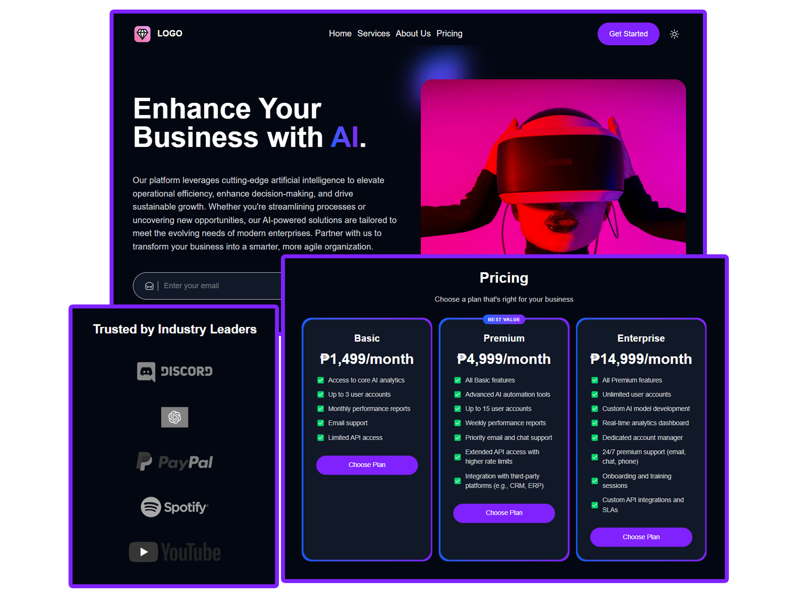

# Modern Landing Page

<div align="center">
  <a href="https://youtu.be/qeCBBxZoqAM" target="_blank">
    
  </a>
  <br />
  <div>
    
    
    
    
    
  </div>
</div>

### ⚙️ Tech Stack

- **React** – For building the user interface
- **Vite** – For fast development and optimized builds
- **Tailwind CSS** – For rapid, responsive styling using a design token system
- **TypeScript** – For type safety and modern JavaScript features
- **Zustand** – For lightweight state management and theme persistence

### ⚡️ Features

- **Modern Landing Page Design:**  
  A sleek, responsive design that highlights the website unique value.

- **Dark/Light Mode:**  
  Seamlessly toggle between dark and light mode with Zustand and Tailwind CSS design tokens.

- **Interactive Components:**  
  Build reusable sections such as Hero, Features, Pricing, and CTA using React components.

- **Animated Elements:**  
  Smooth hover animations and gradient effects for a dynamic user experience.

- **State Management:**  
  Global UI state management with Zustand ensures persistent theme settings across sessions.

## 🔑 Getting started

### Installing Dependencies

```bash
npm install
```

### Run

```bash
# Run in development mode
npm run dev

# Build for production
npm run build

# Run in production mode
npm start
```

Open [http://localhost:3000](http://localhost:3000) with your browser to see the result.
